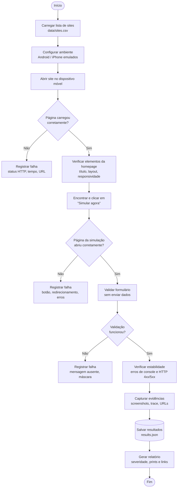

# QA-Bot: Automação de QA para Sites de Consórcio

Verificação automática de landing pages de consórcio em **dispositivos móveis** (Android e iPhone emulados), com coleta de evidências e **relatório em texto** mostrando o que foi encontrado, a severidade, o print da tela e o link do site.

O projeto segue um fluxograma que vai da lista de sites até o relatório consolidado. Cada caixa do fluxograma virou uma etapa (`test.step`) do teste.

---

## Sumário

- [Visão geral do fluxo](#visão-geral-do-fluxo)
- [O que é testado](#o-que-é-testado)
- [Dispositivos e navegadores](#dispositivos-e-navegadores)
- [Tipos de falha e severidade](#tipos-de-falha-e-severidade)
- [Ferramentas e tecnologias](#ferramentas-e-tecnologias)
- [Estrutura do projeto](#estrutura-do-projeto)
- [Instalação](#instalação)
- [Configuração](#configuração)
- [Como executar](#como-executar)
- [Relatório](#relatório)
- [Dados sensíveis e segurança](#dados-sensíveis-e-segurança)
- [Decisões técnicas](#decisões-técnicas)
- [Roadmap](#roadmap)

---

## Visão geral do fluxo



**Resumo:** `Início → Execução dos testes → Coleta de dados → Relatório → Fim`

---

## O que é testado

| Verificação | Status | Como |
|---|:-:|---|
| Carregamento das páginas | ✅ | Status HTTP do documento final e tempo até o CTA aparecer |
| Redirecionamentos | ✅ | Detecta link antigo que responde **404** e só redireciona via JavaScript |
| Links quebrados / páginas fora do ar | ✅ | Reprova quando a página final responde ≥ 400 |
| Elementos da homepage | ✅ | Presença do título principal (`h1`) |
| Responsividade | ✅ | Detecta rolagem horizontal no celular |
| Botão "Simular agora" | ✅ | Encontra o CTA **realmente clicável** (visível, estável e não coberto) |
| Fluxo de simulação | ✅ | Clica no CTA e confirma que o simulador abriu |
| Validação de formulário | ✅ | Campo obrigatório exibe mensagem de erro (sem enviar dados) |
| Erros de console | ✅ | `console.error` e exceções JavaScript da página |
| Erros HTTP (4xx/5xx) | ✅ | Requisições dos domínios próprios que falharam |
| Performance | ✅ | Alerta quando o carregamento passa do limite (padrão 10 s) |
| Screenshots como evidência | ✅ | Print em toda execução + trace completo nas falhas |
| Máscaras de CPF / telefone | 🔜 | Depende de telefone de teste (a etapa envia SMS) |
| Problemas visuais evidentes | 🔜 | Análise dos prints com IA |
| Sobreposição de elementos | 🔜 | Checagem de elementos sobrepostos na viewport |

> **Política de não envio:** os testes **nunca** enviam formulários com dados pessoais nem disparam SMS. A validação é feita só com campos vazios ou valores inválidos, para não gerar leads falsos. Ver [Dados sensíveis e segurança](#dados-sensíveis-e-segurança).

---

## Dispositivos e navegadores

| Projeto | Dispositivo emulado | Motor |
|---|---|---|
| `android` | Pixel 7 | Chromium |
| `iphone` | iPhone 15 | WebKit (motor do Safari) |

Todos rodam com `locale: pt-BR` e fuso `America/Sao_Paulo`. Para outras resoluções, é só adicionar projetos em [playwright.config.ts](playwright.config.ts) usando qualquer item de `devices` do Playwright.

---

## Tipos de falha e severidade

| Severidade | Significado | Exemplos |
|---|---|---|
| 🔴 **Crítica** | Impede o uso do site | Página fora do ar (404/500), botão "Simular agora" ausente ou sem clique, simulador não abre |
| 🟠 **Alta** | Afeta o fluxo, mas há contorno | Não foi possível chegar ao formulário, validação não funciona |
| 🟡 **Média** | Prejudica a experiência ou o SEO | Link que responde 404 antes de redirecionar, carregamento lento, erros HTTP em recursos |
| 🟢 **Baixa** | Ajustes visuais ou técnicos | Erros de console, rolagem horizontal |

As falhas **Críticas** reprovam o teste. As demais ficam registradas como *alerta* (via `registrarFalha`) sem interromper o fluxo, para que um único teste revele vários problemas de uma vez.

---

## Ferramentas e tecnologias

- **Node.js 22.5+** (testado no 26) + **TypeScript**
- **[Playwright](https://playwright.dev/)**: automação e emulação mobile
- **[csv-parse](https://csv.js.org/parse/)**: leitura da lista de sites
- **[dotenv](https://github.com/motdotla/dotenv)**: configuração local
- **[Anthropic SDK](https://github.com/anthropics/anthropic-sdk-typescript)**: análise e resumo executivo com Claude *(roadmap)*
- **`node:sqlite`** (nativo do Node): histórico de resultados *(roadmap)*
- **tsx**: executa TypeScript direto, sem build

---

## Estrutura do projeto

```
.
├── data/
│   ├── sites.example.csv   # modelo da lista de sites (versionado)
│   └── sites.csv           # lista real (NÃO versionada)
├── src/
│   ├── sites.ts            # leitura e filtro do CSV
│   ├── findings.ts         # registrarFalha(): alertas com severidade
│   ├── page-helpers.ts     # cookies, CTA clicável, monitor de erros
│   └── relatorio.ts        # gera o relatório em Markdown
├── tests/
│   └── sites.spec.ts       # fluxo completo, uma etapa por caixa do fluxograma
├── reports/                # relatórios e prints gerados (NÃO versionado)
├── playwright.config.ts
├── .env.example
└── package.json
```

---

## Instalação

```bash
git clone https://github.com/Martinstein7/QA-Bot.git
cd QA-Bot
npm install
npx playwright install chromium webkit
```

---

## Configuração

1. **Variáveis de ambiente**: copie o modelo e preencha:

   ```bash
   cp .env.example .env
   ```

   | Variável | Obrigatória | Descrição |
   |---|:-:|---|
   | `DOMINIOS_PROPRIOS` | ✅ | Domínios cujos erros HTTP entram no relatório, separados por vírgula (ex.: `exemplo.com.br,framer`) |
   | `SIMULADOR_HOST` | ✅ | Host do simulador para onde o "Simular agora" deve levar (ex.: `simulador.exemplo.com.br`) |
   | `ANTHROPIC_API_KEY` | – | Chave da API do Claude, usada pelo relatório com IA *(roadmap)* |

2. **Lista de sites**: copie o modelo e coloque as URLs reais:

   ```bash
   cp data/sites.example.csv data/sites.csv
   ```

   | Coluna | Descrição |
   |---|---|
   | `produto` | Linha de produto (ex.: `compra-planejada`, `consorcio`) |
   | `categoria` | Categoria (ex.: `celular`, `moto`, `automovel`, `imovel`) |
   | `parceiro` | Identificador do parceiro |
   | `url` | Link público divulgado (o teste segue os redirecionamentos) |
   | `ativo` | `sim` para testar, `nao` para pular sem apagar a linha |

---

## Como executar

```bash
# Todos os sites, nos dois dispositivos
npm test

# Só um dispositivo
npx playwright test --project=iphone

# Só alguns sites (filtro pelo nome "categoria/parceiro")
npx playwright test -g "celular/"

# Gerar o relatório em texto a partir da última execução
npm run relatorio

# Rodar os testes e gerar o relatório em seguida
npm run qa

# Relatório HTML interativo do Playwright (com trace das falhas)
npx playwright show-report
```

---

## Relatório

`npm run relatorio` lê `resultados/results.json` e gera:

- `reports/relatorio-AAAA-MM-DD-HH-MM.md`: relatório com data e hora
- `reports/ultimo-relatorio.md`: cópia do mais recente
- `reports/evidencias/*.png`: prints das execuções com problema

Conteúdo do relatório:

1. **Cabeçalho**: data, número de sites, dispositivos, aprovados / reprovados / com alerta
2. **Contagem por severidade**
3. **Resumo por site**: tabela Android × iPhone com status e tempo de carregamento
4. **Problemas encontrados**: para cada site com problema:
   - 🔗 link testado e ↪️ para onde redireciona
   - cada falha com ícone de severidade e descrição
   - **print da tela** embutido + link para abrir em tamanho real

> Dica: no VS Code, abra o `.md` e use `Ctrl+Shift+V` para ver o relatório com as imagens.

---

## Dados sensíveis e segurança

- **Nada de dados reais no repositório:** `.env`, `data/sites.csv`, prints, relatórios e resultados estão no `.gitignore`. Domínios e hosts ficam só no `.env`.
- **Sem envio de formulário:** o teste para antes de qualquer etapa que envie dados pessoais ou dispare SMS. Isso evita leads falsos no CRM e SMS para números de terceiros.
- **Para testar o fluxo completo** (CPF, telefone, código SMS) é preciso um **telefone e CPF de teste** combinados com o time responsável, para que esses cadastros sejam filtrados.

---

## Decisões técnicas

- **CTA "realmente clicável":** páginas feitas em Framer mantêm cópias ocultas do botão para outros tamanhos de tela e se redesenham logo após carregar. Por isso o teste usa um *trial click* do Playwright, que confirma visibilidade, estabilidade e se o botão está coberto, em vez de clicar no primeiro elemento com o texto.
- **Banner de cookies:** tratado com `page.addLocatorHandler`, então é fechado mesmo se aparecer com atraso.
- **Alertas × reprovação:** só falhas críticas reprovam o teste. As outras são registradas como `annotations`, e assim um único teste revela vários problemas de uma vez.
- **Redirecionamento 404 + JavaScript:** o teste guarda a cadeia de navegação do documento principal. Um primeiro documento com 404 indica link antigo sem redirecionamento no servidor (301/308), o que prejudica SEO e aumenta o tempo de carregamento.
- **Retry = 1:** um teste que falha e passa na segunda tentativa aparece como *instável* no relatório, em vez de ser escondido.

---

## Roadmap

- [x] Lista de sites via CSV
- [x] Emulação Android e iPhone
- [x] Carregamento, redirecionamento e performance
- [x] "Simular agora" → simulador
- [x] Validação de campo obrigatório no formulário
- [x] Erros de console e HTTP
- [x] Evidências (screenshots e trace)
- [x] Relatório em texto com severidade, prints e links
- [ ] Validação de máscaras de CPF e telefone com dados de teste
- [ ] Histórico de execuções em banco (`node:sqlite`)
- [ ] Relatório com IA (Claude): classificação, impacto para o cliente, recomendações e resumo executivo
- [ ] Exportação do relatório em PDF
- [ ] Execução agendada (CI / cron)
